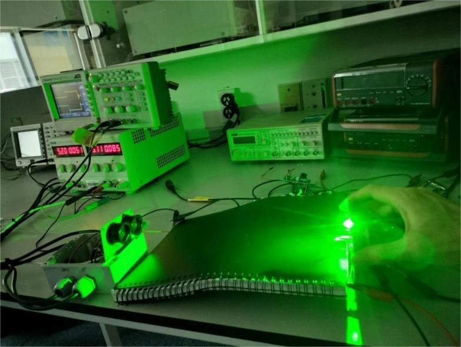
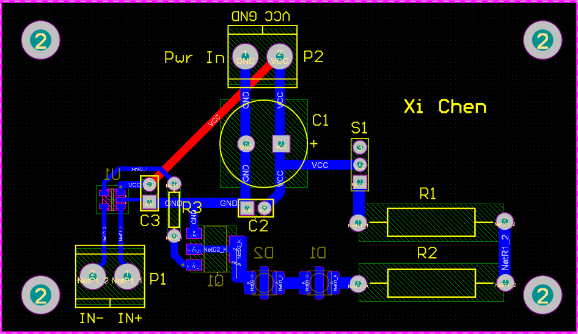

 
# Underwater Optical LED Transmitter          

A high-power, multi-wavelength LED-based transmitter designed for Underwater Optical Wireless Communication (UOWC) systems. This project aims to enable high-speed, short- to mid-range underwater data transmission using modular optical hardware and differential signaling.          

## 🔍 Project Overview    

This project was completed as part of my Master of Engineering Studies at Auckland University of Technology under the supervision of Prof. Boon-Chong Seet and with the support of PhD researcher Tharuka Govinda Waduge. It explores the use of blue (470–499 nm), green (500–530 nm), and yellow (550–600 nm) LEDs for underwater optical data transmission. The system was designed to operate up to 4 MHz with stable signal and thermal performance.                  

## ⚙️ Features  

* Multi-wavelength signaling using Blue, Green, and Yellow high-power LEDs.  

* Signal modulation via MOSFET + Gate Driver architecture.      

* Operating frequency up to 4 MHz.      

* Custom-designed modular PCB with decoupling and heat dissipation optimizations.    

* Frequency-dependent current and thermal performance testing.    

* Designed for future underwater deployment (currently tested in air).  

## 🧩 System Architecture  

**Hardware Components:**         

* IN-C33(X)TL(X) Series 3535 LEDs

* BUK98150-55A N-channel MOSFETs      

* UCC27517A Gate Driver      

* Custom-designed two-layer PCB in Altium Designer    

* Function Generator + Oscilloscope for modulation testing    

**Design Highlights:**

* Modular LED branches with selectable power output (0.5W, 1W, 2W)  

* Decoupling capacitors (100μF + 0.1μF) per branch  

* Power routing and signal isolation to minimize EMI  

* Thermal vias and copper pour to enhance dissipation      

## 🔬 Testing & Results  

Tests were conducted in lab (air environment)
### 🖼️ Part of the experimental test process  

**Heat Dissipation:**  

Stable operation at 1.5–2W power with <80°C max component surface temp

**Frequency-Dependent Current:**    

Demonstrated working signal modulation up to 4 MHz  

**Signal Integrity:**  

Clean transitions observed via oscilloscope at key MOSFET and LED nodes

**Transmitter-Receiver Interaction:**      

Optical signal successfully received at 1–4 MHz using photodiode circuit    

### 🖼️ Simple Branch PCB Layout (Altium Designer)  
  

## 🚀 Future Work  

* Underwater testing in controlled environments        

* Integrate modulation schemes (e.g., 4-PPM, OFDM)    

* Explore custom LED packaging for higher frequency response

## 👤 Author

**Xi Chen**   

Master of Engineering (Power and Control), AUT

Email: mnchenxi@gmail.com

LinkedIn: [linkedin.com/in/xichennew](https://linkedin.com/in/xichennew)  
